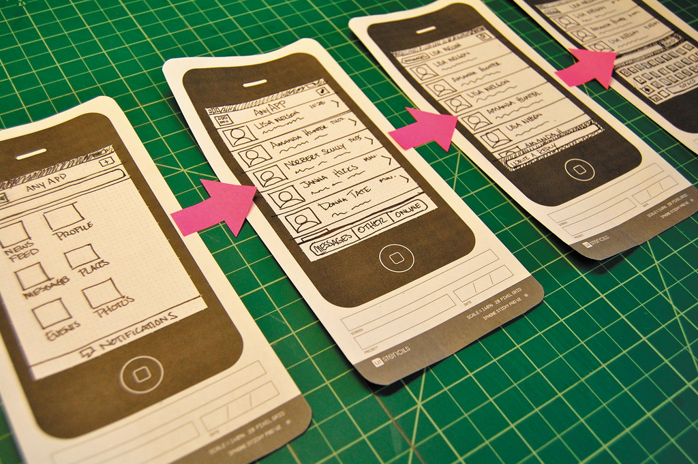

# ~~Let's ditch visual design tools~~
# Let's validate with code

## Wow, why? What happened?
As a student working as a front-end developer I've run into a particularly annoying scenario when creating an app from a visual design. A ux-designer spend a good few weeks on creating the correct user-flow, feedback for the user, necessary pages and elements, icons, you get the idea. It was great to have all of these things figured out before i started coding. The design made sense and the overall flow of the app was clear.

The internship of the ux-designer ended right about at the time I picked up the project. I started up the project, build the main structure and loaded in the data for the app. I soon realized the design would not work for the dataset. The ux-designer didn't had the full dataset and guesstimated the amount of data that needed to be displayed. Instead of three chunks of data I loaded in 52 chunks of data. After all, this is what the admin of the app would see.

The design broke. It was build on those same three chunks of data. As a developer I had to alter the design to fit the correct dataset. Being a developer with experience in visual and ux-design this didn't mean the end of the world. I made a well working design and the project went on. Still, the app probably would work better if a full ex-designer would think the design out based on this dataset.

## Well, you can hardly expect a ux-designer to ditch visual design tools.
Correct. Maybe the statement in this title isn't correct (but it surely grabs a designers attention). I'm not pleating for a complete code-based work-flow. At least end with it. As a designer for these apps you've got the responsibility to make sure that this design is correct and is not build on assumptions.

> 'Photoshop and Sketch are great tools, but you make assumptions.' - *Stephen Hay, 2017*

In the case mentioned previously the problem could easily be resolved by making a small working prototype based on the real dataset. The dataset, being a nice JSON file, could easily be loaded into the prototype and used to render out components. If this was done, the ux-designer would have spotted and resolved the problem immediately. Instead, I had to make design decisions. You can imagine what could have happened if a developer without visual and ux-design skills was tasked to do this.

## So, that's all?
No, it's not. The next example is a mistake I made while designing a client's website. During my studies and work I manage to squeeze in some time in the weekend to do freelance work. I made a design with a nice page-wide video banner. Because the page wouldn't have much content in the form of text I showed what the client stood for in the form of images. It was a visually stunning website and the client was content with the design.

I started to develop the website shortly after that. The site ran well, on my machine. The resources loaded quickly because they were loaded locally. As soon as I uploaded a first version of the website to a sub-domain of my website in order to show it to my client I discovered an issue. Loading the page took way too long.

What I learned from this was that you should not only prototype the product in code to check if the design works. You should run it the way it will be when it's live. In your visual design tool and on your localhost the design works perfectly, but how does it perform when it's live?

## The right data, the correct performance. Check.
Hold on, you're not done yet! The final thing I can't stress enough is the viewports in between. Open up your favorite visual design tool and look at the viewports provided. Just yesterday I did exactly this. I opened up Adobe XD, a new cool kid on the block for creating ux-designs. Adobe XD, as most visual design tools, provide the option of using artboards based on device widths and heights. I fell for this a lot of times in the past. I would make designs for mobile phones, tablets, desktops. Between those breakpoints it would just be fluid.

To circle back to the example with my client's visually stunning website. The page worked. Nice, all the elements position correctly between the viewports. Just before celebrating this I noticed something. the many images were set to cover the container in width. On some of the weird viewports, like 2500px, the image quality degrade as a result of accommodating the width of the page.

> 'Where do the design and content not work anymore?' - *Stephen Hay, 2017*

So there I am, being left with two options. Either load in higher resolution images and videos or change the design completely. This could have easily been prevented by testing these things in prototypes in code. Instead, I'm confronted with a difficult design decision.

## Long story long
Don't use prototyping in code to build your design. Use prototyping in code to validate your design. In the world of the world wide web there are a lot of pitfalls. Make sure to check for some of these if you don't want to have a developer do your work.

